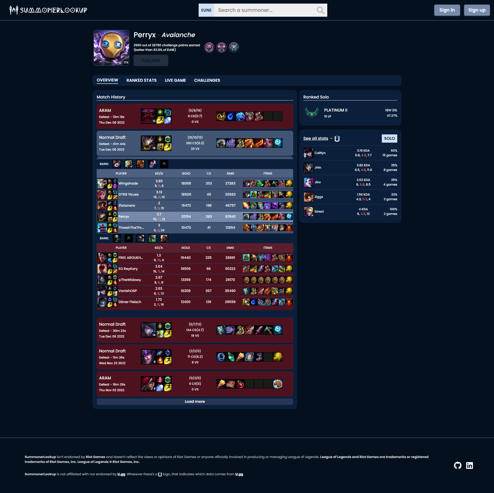
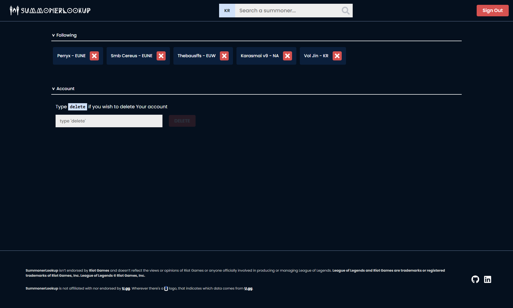

# Summoner Lookup

## Summoner Lookup is a web app used to look up League of Legends players, made with React

### [Client](https://summoner-lookup.vercel.app/) ------ [Server Swagger docs](https://slup-server-production.up.railway.app/docs)

Web app that lets you look up specific players who play League of Legends and see their match history, champion stats in ranked queues, if they're in an ongoing game and their completed challenges. 

You are able to make an account and 'follow' any of the players so you don't have to remember their names; if you find someone interesting but you might forget their name, for example.

Essentially, it's a lesser version of any of the popular websites such as [u.gg](u.gg) or [op.gg](op.gg).
## Client

Client side was created using [Create-React-App](https://reactjs.org/docs/create-a-new-react-app.html) as the starting point of the project. Folder structure for components is using the [Atomic Design](https://danilowoz.com/blog/atomic-design-with-react) methodology - smallest components are Atoms, Atoms make bigger components; Molecules, Molecules and Atoms make Organisms and all of them together make Pages. For styling, I went with styled-components because it looked more interesting at the time, compared to just SASS or some other library.

Libraries used:
* React
* [React-Router-Dom](https://reactrouter.com/en/main) - lightweight, fully-featured routing library for React.
* [TanStack Query](https://tanstack.com/query/v4) - framework agnostic asynchronous state management library.
* [TanStack Table](https://tanstack.com/table/v8) - headless UI for building powerful tables & datagrids.
* [styled-components](https://styled-components.com/) - CSS-in-JS styling library.
* [React-Hook-Form](https://react-hook-form.com/) - performant, flexible and extensible forms with easy-to-use validation.
* [Yup](https://github.com/jquense/yup) - schema builder for runtime value parsing and validation, paired with React-Hook-Form.
* [React-Icons](https://react-icons.github.io/react-icons) - a "one-stop-shop" for all of the popular icons.

## Server

Server is using the MVC (Model-View-Controller) architectural pattern using the Express server framework, just without the View part since it's not serving any static pages.

It handles both the internal API for CRUD operations, user authentication/authorization, using the JWT access/refresh token pairs each signed with a pair of public/private RSA256 keys, and the external APIs for fetching player data, from Riot's and U.gg's APIs.

Libraries used:
* [expressjs](https://expressjs.com/) - unopinionated, minimalist web framework for Node.js.
* [express-rate-limit](https://github.com/express-rate-limit/express-rate-limit) - Basic rate-limiting middleware for Express.
* [cors](https://github.com/expressjs/cors) - express middleware for enabling CORS with various options.
* [node-fetch](https://github.com/node-fetch/node-fetch) - A light-weight module that brings Fetch API to Node.js.
* [mongoose](https://mongoosejs.com/) - straight-forward, schema-based, elegant mongodb object modeling for node.js.
* [redis](https://redis.io/) - in-memory data structure store, used as a database, cache.
* [bcryptjs](https://github.com/dcodeIO/bcrypt.js) - password encryption library.
* [jsonwebtoken](https://github.com/auth0/node-jsonwebtoken) - library used for signing and verifying JWTs.
* [@hapi/joi](https://github.com/hapijs/joi) - schema description language and data validator for JavaScript.
* [dotenv](https://github.com/motdotla/dotenv) - zero-dependency module that loads environment variables from a .env file into process.env.
* [helmet](https://github.com/helmetjs/helmet) - express middleware that helps to secure the app by setting various HTTP headers.
* [cookie-parser](https://github.com/expressjs/cookie-parser) - parse Cookie header and populate req.cookies with an object keyed by the cookie names.
## Introspection

#### `What was your motivation?`

My motivation was further improvement as a self-taught software developer. 

#### `Why did you build this project?`

I built this project to teach myself the fundamentals of React development and to teach myself how to host a project online instead of it just sitting my PC or in a private Github repository for no one else to see.

#### `What did you learn?`

I learned how to work with multiple APIs at the same time, how JWT authentication/authorization flow works. I learned about optimistic updates with TanStack React Query so the web app feels snappier.

I learned about Atomic Design and how I never want to willingly use it again, same with styled-components to a certain extent. 

I learned how not to grow frustrated if things don't work as I expect them to when working with third party APIs and that I'm capable of bashing my head against the wall until I figure it out.
